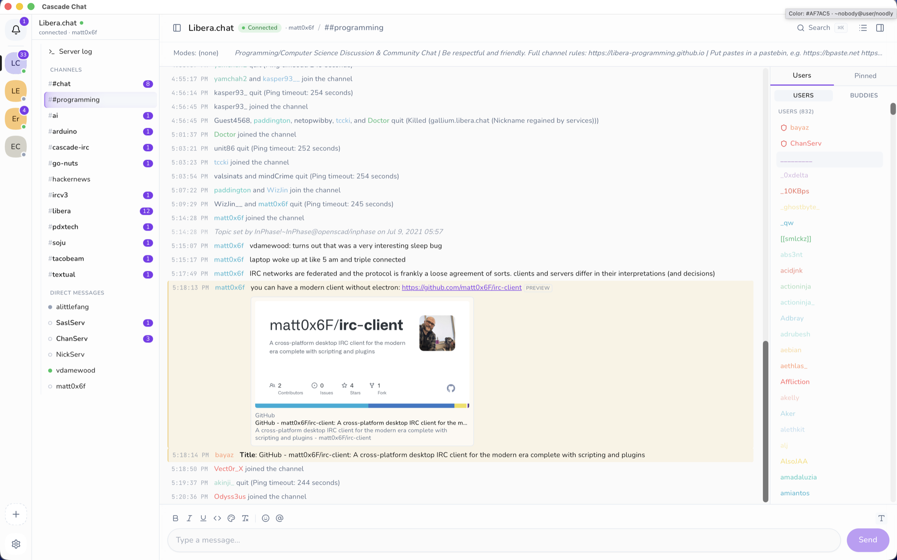

<p align="center">
  
</p>

<h1 align="center">Cascade Chat</h1>

<p align="center">
  A modern desktop IRC client with deep IRCv3 support, persistent history, and an open plugin system.
</p>

<p align="center">
  <a href="https://github.com/matt0x6F/irc-client/releases"><strong>Download Cascade</strong></a>
  ·
  <a href="https://matt0x6f.github.io/irc-client/">Documentation</a>
  ·
  <a href="https://web.libera.chat/#cascade-irc">Join #cascade-irc</a>
</p>



Cascade keeps the parts of IRC that still work: open networks, durable communities,
and control over your client. It adds the desktop features you expect today, including
searchable history, replies, typing indicators, link previews, pinned messages, native
notifications, and themes.

## Why Cascade

- **IRCv3 throughout.** Server-time, chat history, replies, typing indicators, account
  tracking, away state, extended monitor, and the rest of the ratified capability set
  are wired into the interface instead of hidden behind protocol support.
- **Made for busy networks.** Keep multiple networks organized with unread counts,
  mentions, a buddy list, pinned messages, channel search, and full-text message search.
- **Your history stays useful.** SQLite-backed storage keeps scrollback fast and local.
  Server history is merged by message ID, so reconnects do not fill your timeline with
  duplicates.
- **Built to be extended.** Write lightweight in-process scripts in Go, or build
  out-of-process plugins in any language using JSON-RPC over stdin and stdout.

Cascade runs on macOS, Windows, and Linux. The interface is built with React and
Tailwind CSS inside a lightweight [Wails](https://wails.io/) desktop shell; the IRC,
storage, scripting, and plugin layers are written in Go.

## Download

Prebuilt packages are available from the
[Releases page](https://github.com/matt0x6F/irc-client/releases):

- **macOS:** Universal DMG for Apple Silicon and Intel
- **Windows:** Installers for `amd64` and `arm64`
- **Linux:** AppImage, `.deb`, and `.rpm` packages for `amd64` and `arm64`

The current builds are not code-signed, so your operating system may ask you to confirm
the first launch. See [Install & first run](docs/public/users/install.md) for the exact
steps on each platform.

## Build from source

You will need Go 1.25+, Node.js 20, [Task](https://taskfile.dev), and the
[Wails v3 CLI](https://v3alpha.wails.io/getting-started/installation/).

```bash
git clone https://github.com/matt0x6F/irc-client.git
cd irc-client
task setup
task dev
```

Run `task build` for a production build on your current platform. Run `task check` to
format, lint, test, and type-check the project.

<details>
<summary>Common development commands</summary>

| Command | Purpose |
| --- | --- |
| `task dev` | Start Cascade with hot reload |
| `task build` | Build for the current platform |
| `task package` | Create a distributable app or installer |
| `task check` | Run formatting, linting, tests, and type checks |
| `task go-test` | Run the Go test suite |
| `task frontend-type-check` | Type-check the React frontend |
| `task dmg-universal` | Build a universal macOS DMG |
| `task --list` | Show every available task |

</details>

## Extend Cascade

Cascade offers two ways to add behavior:

- [Scripts](docs/public/scripting/index.md) run in-process and are a good fit for personal
  automation, event handlers, and timers.
- [Plugins](docs/public/developers/plugin-system.md) run as separate processes, subscribe
  to Cascade events, register commands, and can provide UI metadata. They can be written
  in any language that can speak JSON-RPC.

The repository includes example plugins in [`plugins/`](plugins/) for nickname coloring
and completion.

## Architecture

```text
React + TypeScript UI
        │ Wails bindings
        ▼
Go application ── IRC core ── IRC networks
        ├──────── SQLite history and search
        ├──────── Go scripting runtime
        └──────── JSON-RPC plugin processes
```

Start with the [technical documentation](agents.md) for the codebase structure and
development conventions. The [IRCv3 support matrix](docs/public/developers/ircv3-support.md)
documents each supported capability and where it appears in the client.

## Community

Questions, bug reports, and contributions are welcome. Open an
[issue](https://github.com/matt0x6F/irc-client/issues), or join
[#cascade-irc on Libera.Chat](https://web.libera.chat/#cascade-irc)
(`ircs://irc.libera.chat:6697/#cascade-irc`).

## License

Cascade Chat is available under the BSD 3-Clause License.
