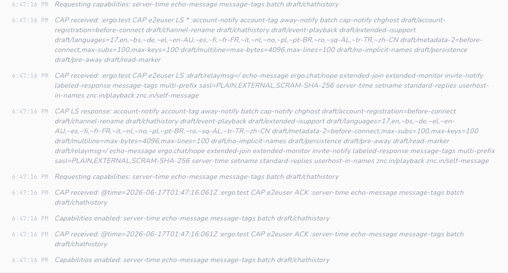
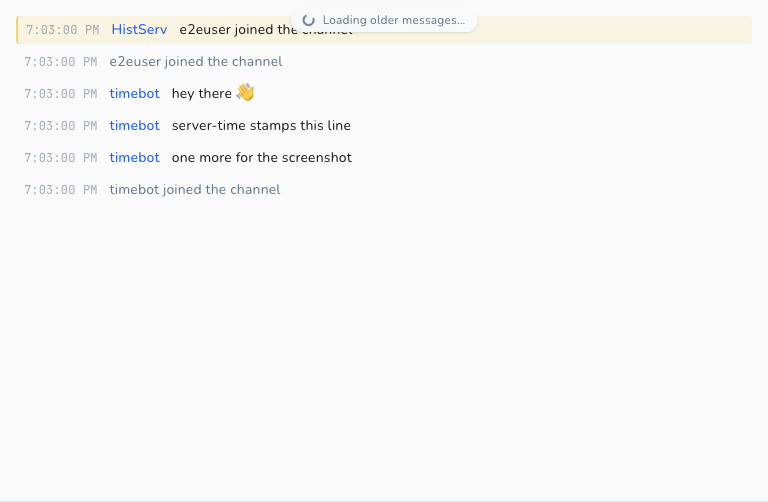
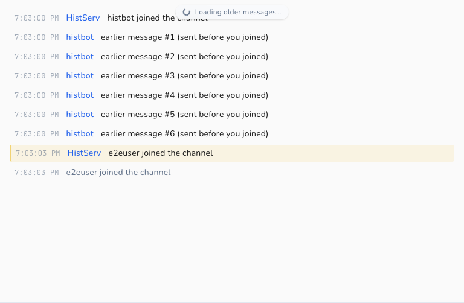
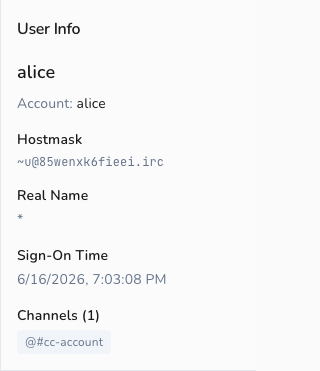

# IRCv3 Support

Cascade is a modern IRC client with first-class [IRCv3](https://ircv3.net/) support. This
document describes every IRCv3 capability Cascade negotiates, what it does with each one,
and how each surfaces in the client.

It serves two audiences:

- **Users / evaluators** — start with [What you get](#what-you-get).
- **Contributors** — the [capability status matrix](#capability-status-matrix) and
  [per-capability reference](#per-capability-reference) include code pointers
  (`file:line`) and screenshots produced by the e2e suite.

> Screenshots in this document are generated by Playwright tests against a real
> [Ergo](https://ergo.chat/) server — see [How the screenshots are made](#how-the-screenshots-are-made).

## What you get

Because of its IRCv3 support, Cascade gives you:

- **Secure login** — SASL authentication (including SCRAM and TLS client certificates), so
  your password is never sent in the clear and you're identified to services automatically
  on connect.
- **Accurate timestamps** — messages are stamped with the *server's* time (`server-time`),
  so backlog and replayed history show when a message was actually sent, not when your
  client received it.
- **Durable scrollback** — when you join a channel or reconnect, Cascade pulls recent
  history from the server (`chathistory`) and scrolls back further on demand, with
  duplicates filtered out by message ID.
- **No echoed duplicates** — when the server supports `echo-message`, your own messages are
  reconciled with the server's canonical copy instead of appearing twice.
- **Every role at a glance** — with `multi-prefix`, the nick list shows all of a user's channel
  roles (e.g. an op who is also voiced), not just the highest one.

## Capability status matrix

Legend: ✅ Supported · ◐ Partial · ⛔ Not yet

| Capability | Status | Negotiated? | Notes |
|------------|:------:|:-----------:|-------|
| `sasl` | ✅ | Yes (when configured) | PLAIN, EXTERNAL, SCRAM-SHA-256, SCRAM-SHA-512 |
| `server-time` | ✅ | Yes | `@time` tag drives all message timestamps |
| `message-tags` | ✅ | Yes | Foundation for `@time` / `@msgid` consumption |
| `echo-message` | ✅ | Yes | Self-message reconciliation / dedup |
| `batch` | ✅ | Yes | Wraps `chathistory` replays |
| `chathistory` / `draft/chathistory` | ✅ | Yes | Latest-on-join + on-demand backscroll |
| `msgid` (via `message-tags`) | ✅ | n/a | Consumed for history deduplication |
| CAP LS 302 negotiation | ✅ | n/a | Full LS/REQ/ACK/NAK/END lifecycle |
| ISUPPORT (`005`) | ✅ | n/a | PREFIX / CHANMODES parsing for mode handling |
| WHOIS account (`330`) | ✅ | n/a | Shows the account a user is logged in as |
| `multi-prefix` | ✅ | Yes | All membership prefixes parsed; shown as icon (highest) or text (full) per setting |
| `cap-notify` | ✅ | Yes | `CAP NEW` auto-requests newly-offered wanted caps; `CAP DEL` disables withdrawn caps live |
| `account-notify` | ✅ | Yes | Live account login/logout drives the roster + WHOIS |
| `away-notify` | ✅ | Yes | Live away state dims members in the nick list |
| `extended-join` | ✅ | Yes | JOIN's account is recorded into the roster |
| `chghost` | ✅ | Yes | User host changes update the roster |
| `userhost-in-names` | ⛔ | No | NAMES carries nicks only |
| `account-tag` | ✅ | Yes | `@account` on messages keeps the roster account current |
| `invite-notify` | ⛔ | No | — |
| `setname` | ⛔ | No | Live realname changes not tracked |
| `monitor` | ⛔ | No | No presence monitoring of offline nicks |
| `labeled-response` | ⛔ | No | — |
| `standard-replies` | ⛔ | No | — |
| `draft/message-redaction` | ⛔ | No | No REDACT handling |
| `WHOX` (`354`) | ⛔ | No | Plain WHO/WHOIS only |

The set of requested capabilities lives in one place — `internal/irc/client.go:25`:

```go
var requestedCaps = []string{"sasl", "server-time", "echo-message", "message-tags", "batch", "draft/chathistory", "chathistory", "multi-prefix", "cap-notify", "away-notify", "account-notify", "extended-join", "chghost", "account-tag"}
```

`sasl` is only requested when the network has SASL configured (`client.go:1927`); the others
are requested whenever the server advertises them.

## Per-capability reference

### Capability negotiation (CAP LS 302)

Cascade negotiates capabilities using `CAP LS 302`, sent immediately after the connection
opens and before registration completes (`client.go:441`, `client.go:2542`). The `CAP`
handler implements the full lifecycle (`client.go:1875`):

1. **LS** — the advertised list is assembled across multi-line continuations by
   `accumulateCapLS` (`client.go:2384`, called at `client.go:1896`), then intersected with
   `requestedCaps`; only capabilities that are both wanted *and* offered are requested via
   `CAP REQ`. A long list split across lines (as Ergo and Libera send) is handled correctly —
   each non-final line carries a `*` marker and its capabilities are still collected.
2. **ACK** — acknowledged capabilities are recorded in `enabledCaps` (`client.go:1955`),
   which every feature gate consults at runtime.
3. **NAK / no-overlap** — negotiation ends gracefully with `CAP END` (`client.go:1980`).

When SASL is in use, `CAP END` is deferred until authentication finishes.

**In the client:** the full negotiation is logged to the network's Status buffer ("Requesting
capabilities…", "Capabilities enabled…"), so you can see exactly what was negotiated.



### SASL authentication

Cascade requests `sasl` only when the network is configured for it (`client.go:1927`), and
defers `CAP END` until authentication completes. Supported mechanisms (`client.go:2459-2466`):

| Mechanism | How it authenticates | Code |
|-----------|----------------------|------|
| `PLAIN` | base64 `\0user\0pass` | `client.go:2476` |
| `EXTERNAL` | TLS client certificate (empty payload) | `client.go:2493` |
| `SCRAM-SHA-256` | salted challenge-response, no password on the wire | `scram.go` |
| `SCRAM-SHA-512` | as above, SHA-512 | `scram.go` |

The flow: `startSASLAuth` sends `AUTHENTICATE <mechanism>` (`client.go:2420`), and
`handleAUTHENTICATE` dispatches server responses to the mechanism handler
(`client.go:2452`). Progress is emitted on the event bus (`EventSASLStarted`) and written to
the Status buffer.

**In the client:** SASL is configured per network in Settings (mechanism, username,
password / certificate). Success and failure are reported in the network's Status buffer.


### server-time

When `server-time` is enabled, Cascade reads the `@time` tag off each message and uses it as
the message timestamp, parsing RFC3339 with and without fractional seconds and falling back
to local time only if the tag is missing or unparseable (`getMessageTime`,
`client.go:2091-2108`). Replayed history always honors `@time` regardless of the live cap
(`getHistoryTime`, `client.go:2229-2239`), so backlog keeps its original times.

**In the client:** every message renders its timestamp via `toLocaleTimeString()`
(`message-view.tsx:496`, `:528`, `:537`). With `server-time`, these reflect when the message
was sent on the network — important for history and bouncer backlog.



### message-tags

`message-tags` is the substrate the other tag-based features build on. Cascade consumes tags
via the underlying `ergochat/irc-go` library's `GetTag()`:

- `@time` → message timestamps (see [server-time](#server-time))
- `@msgid` → history deduplication (see [chathistory](#chathistory))

Tags Cascade does not yet consume (e.g. `@account`, `@label`) are simply ignored.

### echo-message

With `echo-message`, the server sends your own `PRIVMSG`s back to you. Cascade treats the
echoed copy as canonical so messages aren't duplicated:

- `isEchoMessage` detects a self-message by comparing the sender to your nick, gated on the
  cap being enabled (`client.go:2112-2121`).
- The PRIVMSG path uses this to avoid double-storing locally sent messages
  (`client.go:564-696`), and `pmPeer` keeps echoed private messages keyed to the right
  conversation (`client.go:2127-2132`).

**In the client:** behavior is invisible-when-correct — your messages appear exactly once,
with the server's timestamp and msgid, whether or not `echo-message` is active.

### batch

`batch` lets the server group related messages so the client treats them atomically. Cascade
requires it for `chathistory`: replays arrive wrapped in a `BATCH +id chathistory … -id`
group that `ergochat/irc-go` collects and hands to `handleChatHistoryBatch`
(`client.go:1578-1581`, `client.go:2268-2323`). Non-chathistory batches are passed through
unchanged.

### chathistory

Cascade requests both the ratified `chathistory` and legacy `draft/chathistory` names and
uses whichever the server advertises (`client.go:25`, `chatHistoryEnabled`,
`client.go:2197-2201`). It reads the advertised per-request maximum (`chathistory=N`) and
clamps requests to it (`setChatHistoryMax`/`clampChatHistoryLimit`, `client.go:2185-2216`),
defaulting to 100 when unadvertised (`client.go:2181`).

Two request shapes:

- **Latest-on-join / open** — `RequestChatHistoryLatest` pulls the most recent messages when
  you join a channel or open a query (`client.go:2243`, triggered at `client.go:769-772`).
- **Backscroll** — `RequestChatHistoryBefore` fetches older messages before a cursor
  timestamp for on-demand scrollback (`client.go:2257`).

Replays are deduplicated by `@msgid`: `getMsgID` extracts the tag (`client.go:2219-2224`) and
the storage layer enforces uniqueness so the same message is never stored twice across
overlapping history pulls and live traffic (unique index, `storage/schema.sql:120`).
Coverage lives in `internal/irc/chathistory_test.go` and `internal/storage/chathistory_test.go`.

**In the client:** joining a channel shows recent backlog immediately, and scrolling up loads
older messages seamlessly without duplicates.



### multi-prefix

Without `multi-prefix`, a `NAMES` (`353`) reply carries only the single highest membership
prefix for each user, so someone who is both op and voiced appears as `@nick` and the voice is
invisible. With the cap negotiated, the server sends every prefix the user holds,
highest-privilege first (e.g. `@+nick`).

The `353` handler parses all leading prefix characters off each entry with
`splitMembershipPrefixes` (`client.go`), using the prefix set advertised in ISUPPORT `PREFIX`
(falling back to the standard `~&@%+` set before `005` is seen) and preserving the server's
order. The result is stored in the existing `ChannelUser.Modes` *string*
(`internal/storage/models.go`), which already accommodates several prefixes; `MODE` changes
keep that string ordered via `applyUserPrefix` (`client.go`). No `enabledCaps` runtime gate is
needed — the parser stores whatever the server sends.

**In the client:** the nick list groups each user under their highest role and surfaces the
rest per a Display setting (**Settings → Display → Member role display**): *Icons* shows a
single icon for the highest role; *Text* shows the full prefix string (e.g. `@+`), making
every role visible. The preference is durable (SQLite settings table) and updates live.

### Live roster (away-notify / account-notify / extended-join / chghost / account-tag)

These five capabilities keep the channel member list current as people go away, log in or
out of an account, or change host — without a manual `/who`. They all feed one piece of
session-local state: a per-network map of lowercased nick → `UserMeta{Away, AwayMessage,
Account, Host}` (`internal/irc/events.go`, `internal/irc/client.go`). The map is deliberately
**not** persisted — a nick's away/account/host is only meaningful for the current session and
re-accrues on reconnect (same rationale as bot mode).

Each signal updates the map through `applyUserMeta`, which is idempotent: it only stores and
emits `EventUserMetaChanged` when an attribute actually changed, so high-frequency traffic
(away toggles especially) never spams the UI.

| Capability | Trigger | Handler |
|------------|---------|---------|
| `away-notify` | `:nick AWAY [:msg]` | `handleAway` |
| `account-notify` | `:nick ACCOUNT <acct\|*>` | `handleAccount` |
| `extended-join` | `JOIN #chan <acct> :realname` | `maybeApplyExtendedJoin` (in the JOIN handler) |
| `chghost` | `:nick CHGHOST <user> <host>` | `handleChghost` |
| `account-tag` | `@account` on any PRIVMSG/NOTICE/JOIN | `maybeApplyAccountTag` |

Key lifecycle: a NICK change carries the attributes to the new nick (`renameUserMeta`) and a
QUIT drops them (`removeUserMeta`); PART/KICK do not, since the user may remain in other
channels and these attributes are network-wide.

The backend forwards `EventUserMetaChanged` to the frontend as `usermeta-event`
(`app_events.go`), and the store hydrates on select via `GetNetworkUserMeta` (`app.go`) into a
per-network `userMeta` slice (`frontend/src/stores/network.ts`). Two surfaces read it:

- **Nick list** — away members are dimmed, with their away message on hover
  (`channel-info.tsx`). Per the design, presence transitions are **silent** — they update the
  roster/WHOIS but never write status lines into the channel buffer.
- **WHOIS panel** — shows a live `away` pill + away message, and the account
  (`user-info.tsx`), staying current while the panel is open.

This cluster also motivated making auto-join **evented**: JOIN (which triggers the NAMES list
that builds the roster) now fires on registration completion — `RPL_ENDOFMOTD` (376) /
`ERR_NOMOTD` (422), with a fallback timer armed at `RPL_WELCOME` (001) — instead of a fixed
2-second timer that could send JOINs before the server was ready (`triggerAutoJoin` /
`doAutoJoin`, `client.go`).

### Supporting features

These are not CAP capabilities but are part of Cascade's modern-IRC behavior and interact
with the IRCv3 features above.

- **ISUPPORT (`005`)** — Cascade parses `PREFIX` and `CHANMODES` from ISUPPORT
  (`client.go:1767-1805`, `modeparse.go`) to classify channel and membership modes correctly
  per server. This drives the mode editor UI (`channel-mode-editor.tsx`).
- **WHOIS account (`330`, RPL_WHOISACCOUNT)** — when a user is logged in, the account name is
  captured (`client.go:1748-1762`) and shown in the user info panel
  (`user-info.tsx:128-130`).



## Not yet supported

The capabilities below are recognized as desirable but not yet negotiated. They are grouped
by theme with the main blocker.

**Live presence / roster updates** — `setname` (live realname changes). The rest of this
cluster (`account-notify`, `away-notify`, `chghost`, `extended-join`) is now supported — see
[Live roster](#live-roster-away-notify--account-notify--extended-join--chghost--account-tag).
`setname` is the remaining gap: the roster does not yet track mid-session realname changes.

**Richer NAMES / membership** — `userhost-in-names` (user@host in NAMES). Lower effort; mostly
NAMES parsing and display changes. (`multi-prefix` is now supported — see above.)

**Message metadata** — `draft/message-redaction` (handle REDACT/DELETE), which needs
message-mutation handling. (`account-tag` is now consumed — see the roster section above.)

**Connection & protocol niceties** — `labeled-response` (correlate replies via `@label`), `standard-replies` (uniform
`FAIL`/`WARN`/`NOTE`), `invite-notify`, `monitor` (presence for offline nicks), `WHOX`
(extended WHO). Independent of each other; each is a self-contained addition.

When implementing any of these, add the cap to `requestedCaps` (`client.go:25`), gate
behavior on `enabledCaps`, and update this matrix.

## How the screenshots are made

Screenshots are generated by the Playwright e2e suite, not captured by hand, so they
regenerate as the UI evolves and can't silently drift from real behavior.

- **Specs:** `e2e/tests/screenshots-ircv3.spec.ts`
- **Harness:** the suite boots the headless Wails server-mode binary and a real Ergo IRC
  server via Docker (`e2e/global-setup.ts`, `docker-compose.yml`). Ergo supports the
  capabilities Cascade negotiates, so the rendered behavior is genuine.
- **Traffic:** `e2e/lib/irc-peer.ts` (`IrcPeer`) generates real IRC messages against Ergo;
  helpers in `e2e/lib/actions.ts` drive connect/join/select.
- **Output:** committed under `docs/images/ircv3/` and referenced from this document.

The specs are gated behind the `CASCADE_SCREENSHOTS` env var, so a normal `task e2e` / CI run
skips them and never rewrites the committed PNGs. Regenerate them intentionally:

```bash
cd e2e && CASCADE_SCREENSHOTS=1 npx playwright test tests/screenshots-ircv3.spec.ts
```

> Note: because regeneration is explicit (not part of the default suite), the committed images
> only change when someone deliberately re-runs the specs and commits the result.
