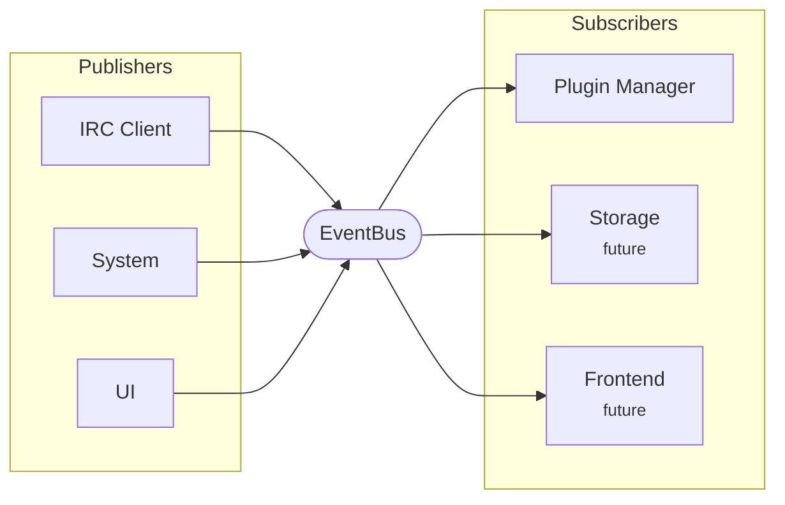

# Events System

The Cascade Chat events system is a centralized, event-driven layer for communication between components. All IRC activities, system events, and UI interactions flow through the EventBus.

## Overview

The events system uses a publisher-subscriber pattern:
- **Publishers** emit events to the EventBus.
- **Subscribers** register interest in specific event types.
- The **EventBus** routes events to all relevant subscribers asynchronously.

### Delivery model

The EventBus has two delivery lanes:

- `Emit` queues durable and control events on a bounded, ordered lane. A single
  dispatcher delivers those events to subscribers in emission order.
- `EmitLatest(key, event)` publishes replaceable snapshot state without
  blocking its caller. While the dispatcher is busy, repeated events with the
  same key are coalesced and only the latest value is retained. Ordered events
  take priority over this snapshot lane.

Use `EmitLatest` only when an event contains a complete current value and
intermediate transitions are not meaningful. For example, `user.meta` is a
full per-network, per-nickname roster snapshot. Messages, connection events,
and completion markers must use `Emit` because dropping or reordering one would
change their meaning.

## Architecture



## Event Structure

All events follow this structure:

```go
type Event struct {
    Type      string                 // Event type identifier
    Data      map[string]interface{} // Event-specific data
    Timestamp time.Time              // When the event occurred
    Source    EventSource            // Source of the event
}
```

### Event Sources

- `irc`: Events from IRC protocol interactions
- `ui`: Events from user interface (future)
- `system`: Events from system components

## Event Types

### IRC Events

All IRC events are defined in `internal/irc/events.go`:

#### Connection Events

- **`connection.established`**: Emitted when successfully connected to an IRC server
  - `networkId` (int64): Network ID
  - `address` (string): Server address
  - `port` (int): Server port

- **`connection.lost`**: Emitted when connection to server is lost
  - `networkId` (int64): Network ID
  - `error` (string): Error message if available

#### Message Events

- **`message.received`**: Emitted when a message is received
  - `networkId` (int64): Network ID
  - `channel` (string): Channel name (empty for PMs)
  - `user` (string): Sender nickname
  - `message` (string): Message content
  - `timestamp` (int64): Unix timestamp

- **`message.sent`**: Emitted when a message is sent
  - `networkId` (int64): Network ID
  - `channel` (string): Channel name (empty for PMs)
  - `message` (string): Message content

#### User Events

- **`user.joined`**: Emitted when a user joins a channel
  - `networkId` (int64): Network ID
  - `channel` (string): Channel name
  - `user` or `nickname` (string): User nickname

- **`user.parted`**: Emitted when a user leaves a channel
  - `networkId` (int64): Network ID
  - `channel` (string): Channel name
  - `user` or `nickname` (string): User nickname
  - `reason` (string): Part reason (optional)

- **`user.quit`**: Emitted when a user quits the server
  - `networkId` (int64): Network ID
  - `user` or `nickname` (string): User nickname
  - `reason` (string): Quit reason

- **`user.kicked`**: Emitted when a user is kicked from a channel
  - `networkId` (int64): Network ID
  - `channel` (string): Channel name
  - `user` or `nickname` (string): Kicked user
  - `kicker` (string): User who performed the kick
  - `reason` (string): Kick reason

- **`user.nick`**: Emitted when a user changes nickname
  - `networkId` (int64): Network ID
  - `old_nickname` (string): Previous nickname
  - `nickname` (string): New nickname

- **`user.meta`**: Replaceable snapshot of a user's live roster attributes
  - `networkId` (int64): Network ID
  - `nickname` (string): User nickname
  - `away` (bool): Whether the user is away
  - `away_message` (string): Away message, when known
  - `account` (string): Authenticated account, when known
  - `host` (string): Current user and host, when known
  - `realname` (string): Current real name, when known
  - Delivery is last-write-wins per network and nickname during a burst. Treat
    this as current state, not as an audit stream of every transition.

#### Channel Events

- **`channel.topic`**: Emitted when channel topic changes
  - `networkId` (int64): Network ID
  - `channel` (string): Channel name
  - `topic` (string): New topic
  - `setter` (string): User who set the topic (optional)

- **`channel.mode`**: Emitted when channel modes change
  - `networkId` (int64): Network ID
  - `channel` (string): Channel name
  - `modes` (string): Mode string (e.g., "+o user")
  - `setter` (string): User who set the mode (optional)

- **`channels.changed`**: Emitted when channel list changes
  - `networkId` (int64): Network ID
  - `channels` ([]string): List of channel names

- **`channel.names.complete`**: Emitted after a channel's NAMES reply completes
  - `networkId` (int64): Network ID
  - `channel` (string): Channel name
  - `users` ([]string): Completed member snapshot

#### SASL Authentication Events

- **`sasl.started`**: Emitted when SASL authentication begins
  - `networkId` (int64): Network ID
  - `mechanism` (string): SASL mechanism (e.g., "PLAIN", "SCRAM-SHA-256")

- **`sasl.success`**: Emitted when SASL authentication succeeds
  - `networkId` (int64): Network ID

- **`sasl.failed`**: Emitted when SASL authentication fails
  - `networkId` (int64): Network ID
  - `error` (string): Error message

- **`sasl.aborted`**: Emitted when SASL authentication is aborted
  - `networkId` (int64): Network ID

#### Other Events

- **`whois.received`**: Emitted when WHOIS information is received
  - `networkId` (int64): Network ID
  - `whois` (WhoisInfo): Parsed WHOIS information (see `internal/irc/events.go`)

- **`error`**: Emitted when an error occurs
  - `networkId` (int64): Network ID (optional)
  - `error` (string): Error message
  - `type` (string): Error type (optional)

### System Events

- **`metadata.updated`**: Emitted when plugin metadata is updated
  - `type` (string): Metadata type (e.g., "nickname_color")
  - `key` (string): Metadata key
  - `value` (interface{}): Metadata value
  - `network_id` (int64): Network ID (optional)
  - `channel` (string): Channel name (optional)
  - Bursts are trailing-edge coalesced by network, channel, type, and key. A
    multi-value event contains an `updates` array of objects with these fields.

### UI Events (Future)

- **`ui.pane.focused`**: Emitted when a pane gains focus
- **`ui.pane.blurred`**: Emitted when a pane loses focus

## Using the EventBus

### Subscribing to Events

```go
// Subscribe to a specific event type
eventBus.Subscribe("message.received", mySubscriber)

// Subscribe to all events (wildcard)
eventBus.Subscribe("*", mySubscriber)
```

### Implementing a Subscriber

Any type implementing the `Subscriber` interface can receive events:

```go
type MySubscriber struct{}

func (s *MySubscriber) OnEvent(event events.Event) {
    // Handle the event
    switch event.Type {
    case "message.received":
        // Process message
    }
}
```

### Emitting Events

```go
eventBus.Emit(events.Event{
    Type:      "message.received",
    Data: map[string]interface{}{
        "networkId": 1,
        "channel":   "#general",
        "user":      "Alice",
        "message":   "Hello!",
    },
    Timestamp: time.Now(),
    Source:    events.EventSourceIRC,
})
```

### Synchronous Events

For tests or the rare case that delivery must finish before the caller
continues, use `EmitSync`:

```go
eventBus.EmitSync(event)
```

**Note**: Synchronous emission blocks until all subscribers process the event. Use sparingly.

## Event Flow Example

1. **IRC Client** receives a PRIVMSG from the server
2. **IRC Client** emits `message.received` event to EventBus
3. **EventBus** routes event to all subscribers:
   - **Plugin Manager** forwards to plugins subscribed to `message.received`
   - **Storage** (future) saves message to database
   - **Frontend** (future) updates UI

## Best Practices

1. **Event Naming**: Use dot-separated hierarchical names (e.g., `user.joined`, `channel.mode`)
2. **Event Data**: Include all relevant context (networkId, channel, etc.)
3. **Async Processing**: `Emit` is asynchronous to its caller, but subscribers
   run serially on the dispatcher. Keep `OnEvent` bounded and non-blocking.
4. **Error Handling**: Handle errors gracefully in subscribers
5. **Wildcard Subscriptions**: Use sparingly; prefer specific event types for performance
6. **Snapshot Semantics**: Use `EmitLatest` only for complete, replaceable state

## Thread Safety

The EventBus is fully thread-safe:
- Subscriptions/unsubscriptions are protected by mutex
- Subscriber lists are copied before callbacks run, so subscriptions can change
  safely while an event is being delivered
- One dispatcher calls subscribers synchronously; a slow subscriber delays
  later delivery, so subscriber work must remain bounded
- Snapshot publication is non-blocking and coalesces under load; ordered
  publication applies bounded backpressure when its queue is saturated

## Future Enhancements

- Event filtering by data fields
- Event replay for debugging
- Event metrics and monitoring

---

## Frontend events

The Go EventBus described above is internal to the backend process. A separate
set of events travels the other direction: from the Go backend to the React
webview via Wails' `Events.Emit` API. The frontend listens with
`Events.On(name, handler)`.

These are distinct from the Go bus events. They carry serialized JSON payloads
rather than `events.Event` structs, and they are consumed by the UI layer, not
by Go subscribers.

### Deep-link events

Emitted when Cascade handles an `irc://` or `ircs://` URI (see
[Opening irc:// links](../users/connecting.md#opening-irc-links)).

#### `deeplink:join`

The link matched exactly one saved network. The frontend should connect (if not
already connected) and join or open each target.

```json
{
  "networkId": 42,
  "targets": [
    { "name": "#cascade", "isNick": false, "key": "" },
    { "name": "alice",    "isNick": true,  "key": "" }
  ]
}
```

| Field | Type | Description |
|---|---|---|
| `networkId` | `number` | ID of the saved network to use. |
| `targets` | `Target[]` | One entry per channel or nick from the URI. |
| `targets[].name` | `string` | Channel name (with `#`) or nickname. |
| `targets[].isNick` | `boolean` | `true` when the target is a nick (opens a PM). |
| `targets[].key` | `string` | Channel key (`?key=…` query param), or empty. |

#### `deeplink:add-network`

The server in the link has no saved network. The frontend should open the Add
Network form prefilled with these values.

```json
{
  "host": "irc.libera.chat",
  "port": 6697,
  "tls":  true,
  "channel": "#cascade"
}
```

| Field | Type | Description |
|---|---|---|
| `host` | `string` | Server hostname from the URI. |
| `port` | `number` | Port, or the scheme default (`6667` / `6697`). |
| `tls` | `boolean` | `true` when the scheme is `ircs://`. |
| `channel` | `string` | First channel from the URI, for display only. Not auto-joined. |

#### `deeplink:disambiguate`

The server matches more than one saved network. The frontend should present a
picker; once the user chooses, proceed as with `deeplink:join`.

```json
{
  "candidates": [
    { "networkId": 1, "name": "Libera (work)"    },
    { "networkId": 7, "name": "Libera (personal)" }
  ],
  "targets": [
    { "name": "#cascade", "isNick": false, "key": "" }
  ]
}
```

| Field | Type | Description |
|---|---|---|
| `candidates` | `Candidate[]` | Networks that match the server in the URI. |
| `candidates[].networkId` | `number` | Saved network ID. |
| `candidates[].name` | `string` | Display name of the network. |
| `targets` | `Target[]` | Same shape as `deeplink:join`; pass through after the user picks. |
