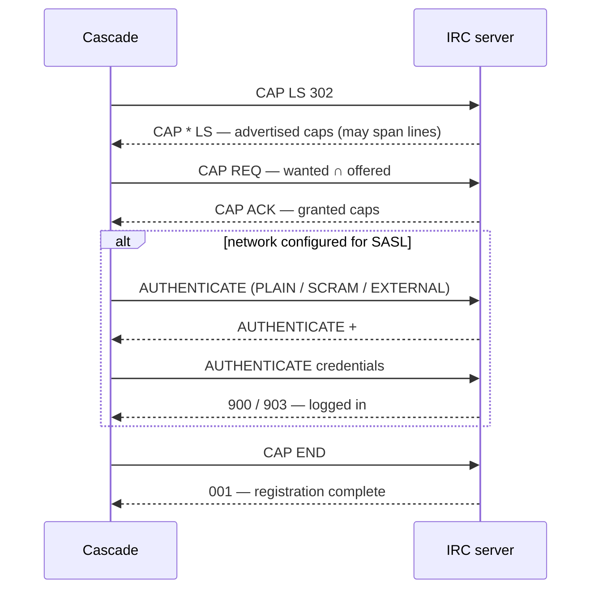
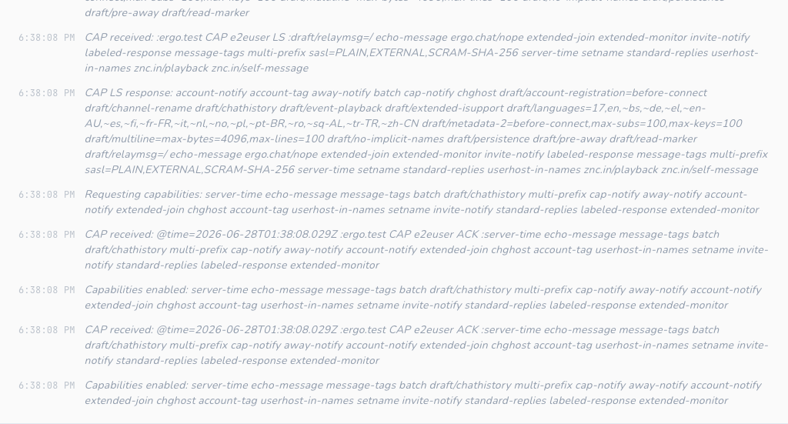
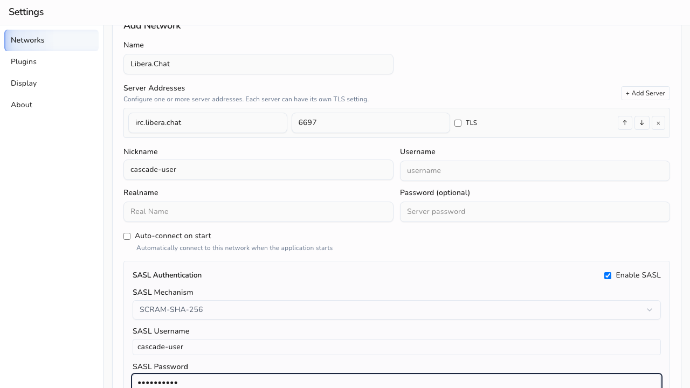
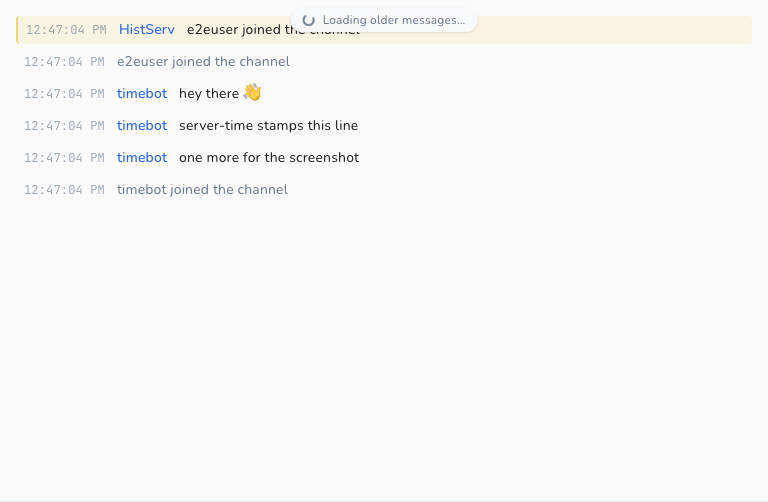
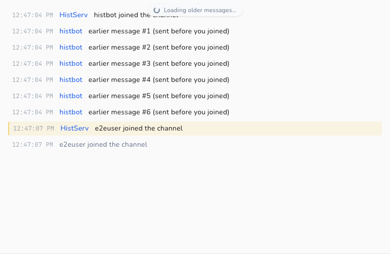
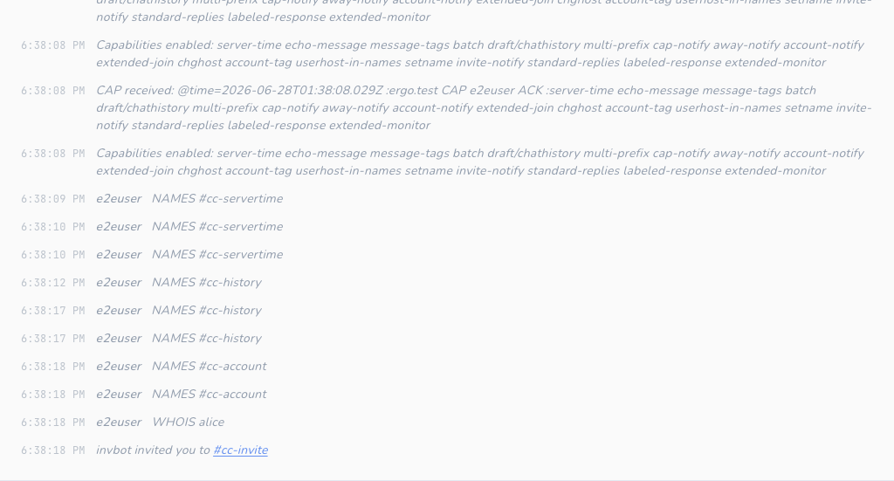
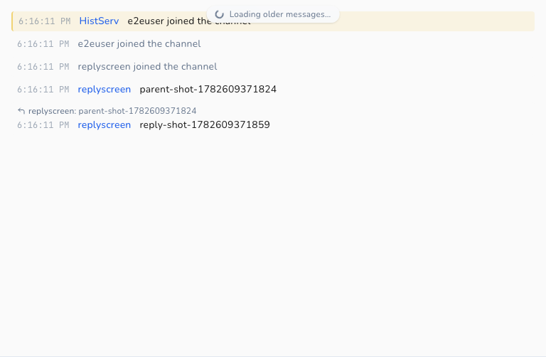
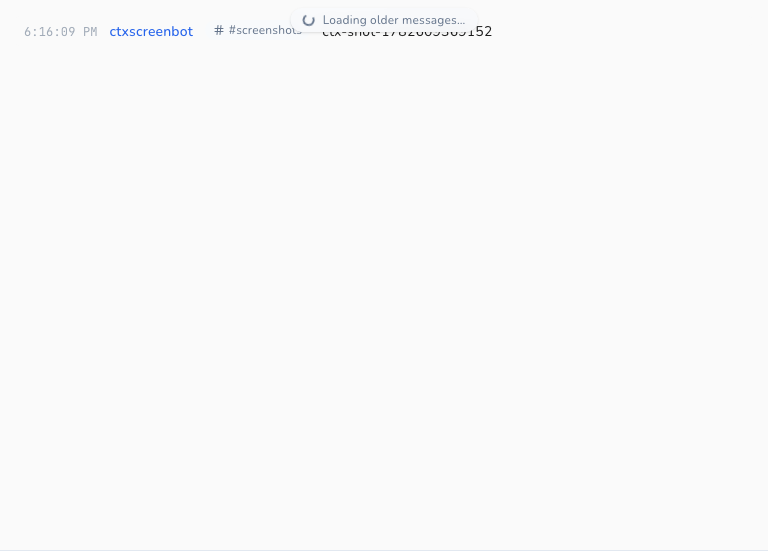
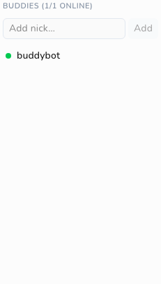
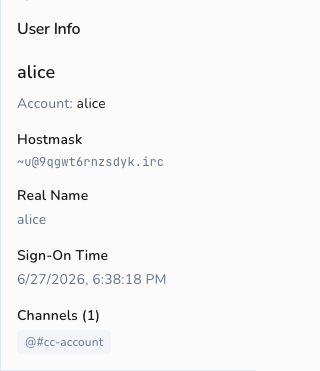

# IRCv3 Support

Cascade is a modern IRC client with first-class [IRCv3](https://ircv3.net/) support. This
document describes every IRCv3 capability Cascade negotiates, what it does with each one,
and how each surfaces in the client.

It serves two audiences:

- **Users / evaluators**: start with [What you get](#what-you-get).
- **Contributors**: the [capability status matrix](#capability-status-matrix) and
  [per-capability reference](#per-capability-reference) include code pointers
  (`file:line`) and screenshots produced by the e2e suite.

> Screenshots in this document are generated by Playwright tests against a real
> [Ergo](https://ergo.chat/) server — see [How the screenshots are made](#how-the-screenshots-are-made).

## What you get

Because of its IRCv3 support, Cascade gives you:

- **Secure login:** SASL authentication (including SCRAM and TLS client certificates), so
  your password is never sent in the clear and you're identified to services automatically
  on connect.
- **Accurate timestamps:** messages are stamped with the server's time (`server-time`), so
  backlog and replayed history show when a message was sent, not when your client received
  it.
- **Durable scrollback:** when you join a channel or reconnect, Cascade pulls recent history
  from the server (`chathistory`) and scrolls back further on demand, with duplicates
  filtered out by message ID.
- **No echoed duplicates:** when the server supports `echo-message`, your own messages are
  reconciled with the server's canonical copy instead of appearing twice.
- **Every role at a glance:** with `multi-prefix`, the nick list shows all of a user's channel
  roles (e.g. an op who is also voiced) rather than only the highest one.
- **A buddy list:** track specific nicks' online/offline presence across restarts in a
  dedicated Buddies pane, even when you share no channel with them (`monitor`). With
  `extended-monitor`, buddies also show live away state.
- **Typing indicators:** see when people in a channel or PM are composing a message, and
  optionally let them see when you are (`+typing` client tag). Both directions toggle
  independently in Settings.
- **Reply quotes:** replies to specific messages render a quote block with the original
  author and text, plus a jump arrow that scrolls to the original, even across buffers
  (`+draft/reply` client tag).
- **Channel context in PMs:** private messages originating from a channel carry an "in
  #channel" pill. Clicking it opens the channel, and replies in the PM thread automatically
  carry the same channel context (`+draft/channel-context` client tag).

## Capability status matrix

Legend: ✅ Supported · ◐ Partial · ⛔ Not yet

| Capability | Status | Negotiated? | Notes |
|------------|:------:|:-----------:|-------|
| `sasl` | ✅ | Yes (when configured) | PLAIN, EXTERNAL, SCRAM-SHA-256, SCRAM-SHA-512 |
| `server-time` | ✅ | Yes | `@time` tag drives all message timestamps |
| `message-tags` | ✅ | Yes | Foundation for `@time` / `@msgid` consumption |
| `echo-message` | ✅ | Yes | Self-message reconciliation / dedup |
| `batch` | ✅ | Yes | Wraps `chathistory` replays |
| `chathistory` / `draft/chathistory` | ✅ | Yes | Latest-on-join + on-demand backscroll |
| `msgid` (via `message-tags`) | ✅ | n/a | Consumed for history deduplication |
| `sts` | ✅ | Read (never `REQ`'d) | Auto-upgrades plaintext→TLS; persists per-host TLS enforcement |
| CAP LS 302 negotiation | ✅ | n/a | Full LS/REQ/ACK/NAK/END lifecycle |
| ISUPPORT (`005`) | ✅ | n/a | PREFIX / CHANMODES parsing for mode handling |
| WHOIS account (`330`) | ✅ | n/a | Shows the account a user is logged in as |
| Bot mode | ✅ | n/a (via `message-tags` + `335` + ISUPPORT) | Detection via `bot` tag and RPL_WHOISBOT; `BOT=<letter>` token parsed into `ServerCapabilities.BotModeChar`; WHO `B` flag recognised via `markBot`; durable per-network "Identify as a bot" setting sends `MODE <nick> +<letter>` at connect |
| `multi-prefix` | ✅ | Yes | All membership prefixes parsed; shown as icon (highest) or text (full) per setting |
| `cap-notify` | ✅ | Yes | `CAP NEW` auto-requests newly-offered wanted caps; `CAP DEL` disables withdrawn caps live |
| `account-notify` | ✅ | Yes | Live account login/logout drives the roster + WHOIS |
| `away-notify` | ✅ | Yes | Live away state dims members in the nick list |
| `extended-join` | ✅ | Yes | JOIN's account is recorded into the roster |
| `chghost` | ✅ | Yes | User host changes update the roster |
| `userhost-in-names` | ✅ | Yes | NAMES carries `nick!user@host`; the host seeds the roster |
| `account-tag` | ✅ | Yes | `@account` on messages keeps the roster account current |
| `invite-notify` | ✅ | Yes | Inbound INVITEs shown as a clickable status line |
| `setname` | ✅ | Yes | Live realname changes update the roster + WHOIS panel |
| `monitor` | ✅ | n/a (ISUPPORT) | Durable per-network buddy list with live presence |
| `labeled-response` | ✅ | Yes | Correlates the WHOX roster query's reply by `@label` |
| `standard-replies` | ✅ | Yes | FAIL/WARN/NOTE shown as error/warning/status lines |
| `extended-monitor` | ✅ | Yes | MONITORed nicks deliver AWAY/ACCOUNT/CHGHOST/SETNAME; buddy away state surfaces in the Buddies pane |
| `no-implicit-names` | ✅ | Yes | Suppresses the post-JOIN NAMES reply; we send an explicit `NAMES` on self-join so the roster still builds |
| `UTF8ONLY` | ✅ | n/a (ISUPPORT) | Server accepts only UTF-8; we already emit UTF-8 exclusively, so the token is recorded and honored by default |
| `account-extban` | ✅ | n/a (ISUPPORT `EXTBAN`) | `$a` / `$a:account` ban masks rendered with a semantic label in the mode editor |
| `+typing` (client tag) | ✅ | n/a (via `message-tags`) | Typing indicators in channels + PMs; send/receive independently toggleable |
| `+draft/reply` (client tag) | ✅ | n/a (via `message-tags`) | Inbound reply quotes rendered with quoted text + jump-to-original; emits `+draft/reply` on send |
| `+draft/channel-context` (client tag) | ✅ | n/a (via `message-tags`) | "in #channel" pill on PM messages; sticky per-PM context; triggers "message privately (re: #channel)" flow |
| `WHOX` (`354`) | ✅ | n/a (ISUPPORT) | Extended WHO on join bulk-seeds the roster |
| `draft/message-redaction` | ⛔ | No | No REDACT handling (draft, out of scope) |

The set of requested capabilities lives in one place, `internal/irc/client.go:31`:

```go
var requestedCaps = []string{"sasl", "server-time", "echo-message", "message-tags", "batch", "draft/chathistory", "chathistory", "multi-prefix", "cap-notify", "away-notify", "account-notify", "extended-join", "chghost", "account-tag", "userhost-in-names", "setname", "invite-notify", "standard-replies", "labeled-response", "extended-monitor", "no-implicit-names"}
```

`sasl` is only requested when the network has SASL configured (`client.go:1927`); the others
are requested whenever the server advertises them.

## Per-capability reference

### Capability negotiation (CAP LS 302)

Cascade negotiates capabilities using `CAP LS 302`, sent immediately after the connection
opens and before registration completes (`client.go:441`, `client.go:2542`). The `CAP`
handler implements the full lifecycle (`client.go:1875`):

1. **LS:** the advertised list is assembled across multi-line continuations by
   `accumulateCapLS` (`client.go:2384`, called at `client.go:1896`), then intersected with
   `requestedCaps`; only capabilities that are both wanted and offered are requested via
   `CAP REQ`. A long list split across lines (as Ergo and Libera send) is handled correctly:
   each non-final line carries a `*` marker and its capabilities are still collected.
2. **ACK:** acknowledged capabilities are recorded in `enabledCaps` (`client.go:1955`),
   which every feature gate consults at runtime.
3. **NAK / no-overlap:** negotiation ends with `CAP END` (`client.go:1980`).

When SASL is in use, `CAP END` is deferred until authentication finishes.



**In the client:** the full negotiation is logged to the network's Status buffer ("Requesting
capabilities…", "Capabilities enabled…"), so you can see exactly what was negotiated.



### SASL authentication

Cascade requests `sasl` only when the network is configured for it (`client.go:1927`), and
defers `CAP END` until authentication completes. Supported mechanisms (`client.go:2459-2466`):

| Mechanism | How it authenticates | Code |
|-----------|----------------------|------|
| `PLAIN` | base64 `\0user\0pass` | `client.go:2476` |
| `EXTERNAL` | TLS client certificate (empty payload) | `client.go:2493` |
| `SCRAM-SHA-256` | salted challenge-response, no password on the wire | `scram.go` |
| `SCRAM-SHA-512` | as above, SHA-512 | `scram.go` |

The flow: `startSASLAuth` sends `AUTHENTICATE <mechanism>` (`client.go:2420`), and
`handleAUTHENTICATE` dispatches server responses to the mechanism handler
(`client.go:2452`). Progress is emitted on the event bus (`EventSASLStarted`) and written to
the Status buffer.

**In the client:** SASL is configured per network in Settings (mechanism, username,
password / certificate). Success and failure are reported in the network's Status buffer.



### server-time

When `server-time` is enabled, Cascade reads the `@time` tag off each message and uses it as
the message timestamp, parsing RFC3339 with and without fractional seconds and falling back
to local time only if the tag is missing or unparseable (`getMessageTime`,
`client.go:2091-2108`). Replayed history always honors `@time` regardless of the live cap
(`getHistoryTime`, `client.go:2229-2239`), so backlog keeps its original times.

**In the client:** every message renders its timestamp via `toLocaleTimeString()`
(`message-view.tsx:496`, `:528`, `:537`). With `server-time`, these reflect when the message
was sent on the network, which matters for history and bouncer backlog.



### message-tags

`message-tags` is the substrate the other tag-based features build on. Cascade consumes tags
via the underlying `ergochat/irc-go` library's `GetTag()`:

- `@time` → message timestamps (see [server-time](#server-time))
- `@msgid` → history deduplication (see [chathistory](#chathistory))

Tags Cascade does not yet consume (e.g. `@account`, `@label`) are simply ignored.

### echo-message

With `echo-message`, the server sends your own `PRIVMSG`s back to you. Cascade treats the
echoed copy as canonical so messages aren't duplicated:

- `isEchoMessage` detects a self-message by comparing the sender to your nick, gated on the
  cap being enabled (`client.go:2112-2121`).
- The PRIVMSG path uses this to avoid double-storing locally sent messages
  (`client.go:564-696`), and `pmPeer` keeps echoed private messages keyed to the right
  conversation (`client.go:2127-2132`).

**In the client:** your messages appear exactly once, with the server's timestamp and msgid,
whether or not `echo-message` is active.

### batch

`batch` lets the server group related messages so the client treats them atomically. Cascade
requires it for `chathistory`: replays arrive wrapped in a `BATCH +id chathistory … -id`
group that `ergochat/irc-go` collects and hands to `handleChatHistoryBatch`
(`client.go:1578-1581`, `client.go:2268-2323`). Non-chathistory batches are passed through
unchanged.

### chathistory

Cascade requests both the ratified `chathistory` and legacy `draft/chathistory` names and
uses whichever the server advertises (`client.go:31`, `chatHistoryEnabled`,
`client.go:2197-2201`). It reads the advertised per-request maximum (`chathistory=N`) and
clamps requests to it (`setChatHistoryMax`/`clampChatHistoryLimit`, `client.go:2185-2216`),
defaulting to 100 when unadvertised (`client.go:2181`).

Two request shapes:

- **Latest-on-join / open:** `RequestChatHistoryLatest` pulls the most recent messages when
  you join a channel or open a query (`client.go:2243`, triggered at `client.go:769-772`).
- **Backscroll:** `RequestChatHistoryBefore` fetches older messages before a cursor
  timestamp for on-demand scrollback (`client.go:2257`).

Replays are deduplicated by `@msgid`: `getMsgID` extracts the tag (`client.go:2219-2224`) and
the storage layer enforces uniqueness so the same message is never stored twice across
overlapping history pulls and live traffic (unique index, `storage/schema.sql:120`).
Coverage lives in `internal/irc/chathistory_test.go` and `internal/storage/chathistory_test.go`.

**In the client:** joining a channel shows recent backlog immediately, and scrolling up loads
older messages seamlessly without duplicates.



### multi-prefix

Without `multi-prefix`, a `NAMES` (`353`) reply carries only the single highest membership
prefix for each user, so someone who is both op and voiced appears as `@nick` and the voice is
invisible. With the cap negotiated, the server sends every prefix the user holds,
highest-privilege first (e.g. `@+nick`).

The `353` handler parses all leading prefix characters off each entry with
`splitMembershipPrefixes` (`client.go`), using the prefix set advertised in ISUPPORT `PREFIX`
(falling back to the standard `~&@%+` set before `005` is seen) and preserving the server's
order. The result is stored in the existing `ChannelUser.Modes` string
(`internal/storage/models.go`), which already accommodates several prefixes; `MODE` changes
keep that string ordered via `applyUserPrefix` (`client.go`). No `enabledCaps` runtime gate is
needed: the parser stores whatever the server sends.

**In the client:** the nick list groups each user under their highest role and surfaces the
rest per a Display setting (**Settings → Display → Member role display**). "Icons" shows a
single icon for the highest role; "Text" shows the full prefix string (e.g. `@+`), making
every role visible. The preference is durable (SQLite settings table) and updates live.

### userhost-in-names

Without this cap a `NAMES` (`353`) reply lists bare nicks, so a user's `user@host` is unknown
until a `WHOIS` or a later `chghost`. With `userhost-in-names` negotiated, the server appends
`!user@host` to every nick in `NAMES` (after any membership prefixes, e.g. `@alice!~alice@host`).

The `353` handler peels prefixes with `splitMembershipPrefixes`, then splits the remainder with
`splitNickUserHost` (`client.go`): the bare nick is stored as the channel member (unchanged),
and the `user@host` is fed into the live roster via `applyUserMeta`. This is the same `Host`
field `chghost` maintains, so the two paths converge. No `enabledCaps` gate is needed: `!` is
not a valid nick character, so its presence is itself the signal. Parsing is covered by
`internal/irc/userhost_test.go`.

**In the client:** hovering a member in the nick list shows their `user@host` in the tooltip
(`channel-info.tsx`), alongside away/colour info, so hosts are visible on join rather than only
after a WHOIS.

### Live roster (away-notify / account-notify / extended-join / chghost / account-tag)

These five capabilities keep the channel member list current as people go away, log in or
out of an account, or change host, all without a manual `/who`. They feed one piece of
session-local state: a per-network map of lowercased nick → `UserMeta{Away, AwayMessage,
Account, Host, Realname}` (`internal/irc/events.go`, `internal/irc/client.go`). The map is
deliberately not persisted; a nick's attributes are only meaningful for the current session
and re-accrue on reconnect (same rationale as bot mode). `Realname` is fed by
[setname](#setname) and `extended-join`.

Each signal updates the map through `applyUserMeta`, which is idempotent: it only stores and
emits `EventUserMetaChanged` when an attribute actually changed, so high-frequency traffic
(away toggles especially) never spams the UI.

| Capability | Trigger | Handler |
|------------|---------|---------|
| `away-notify` | `:nick AWAY [:msg]` | `handleAway` |
| `account-notify` | `:nick ACCOUNT <acct\|*>` | `handleAccount` |
| `extended-join` | `JOIN #chan <acct> :realname` | `maybeApplyExtendedJoin` (in the JOIN handler) |
| `chghost` | `:nick CHGHOST <user> <host>` | `handleChghost` |
| `account-tag` | `@account` on any PRIVMSG/NOTICE/JOIN | `maybeApplyAccountTag` |

Key lifecycle: a NICK change carries the attributes to the new nick (`renameUserMeta`) and a
QUIT drops them (`removeUserMeta`); PART/KICK do not, since the user may remain in other
channels and these attributes are network-wide.

The backend forwards `EventUserMetaChanged` to the frontend as `usermeta-event`
(`app_events.go`), and the store hydrates on select via `GetNetworkUserMeta` (`app.go`) into a
per-network `userMeta` slice (`frontend/src/stores/network.ts`). Two surfaces read it:

- **Nick list:** away members are dimmed, with their away message on hover
  (`channel-info.tsx`). Per the design, presence transitions are silent: they update the
  roster/WHOIS but never write status lines into the channel buffer.
- **WHOIS panel:** shows a live `away` pill + away message, and the account
  (`user-info.tsx`), staying current while the panel is open.

This cluster also motivated making auto-join evented. JOIN (which triggers the NAMES list
that builds the roster) now fires on registration completion at `RPL_ENDOFMOTD` (376) /
`ERR_NOMOTD` (422), with a fallback timer armed at `RPL_WELCOME` (001). The old behavior was a
fixed 2-second timer that could send JOINs before the server was ready (`triggerAutoJoin` /
`doAutoJoin`, `client.go`).

### WHOX (extended WHO)

The live-roster caps fill in attributes as they change, but a freshly-joined channel starts
blank until someone goes away or speaks. [WHOX](https://ircv3.net/specs/extensions/whox), an
extended `WHO` advertised by the `WHOX` ISUPPORT token (not a CAP), closes that gap by fetching
every member's attributes in one shot.

On our own JOIN, when the server advertised `WHOX` (`c.supportsWHOX`, set in the `005` handler),
`requestWHOX` issues `WHO <channel> %tcuhnfar,<token>` (`client.go`). The reply rows arrive as
`354` (RPL_WHOSPCRPL) in WHOX's canonical field order — token, channel, user, host, nick, flags,
account, realname — and each is folded into the live roster by `applyWhoxRow` via `applyUserMeta`:
host (`user@host`), away (the `flags` field begins with `G`), account (`"0"`/`"*"` → none), and
realname. Correlation uses one of two paths: when `labeled-response` is available the reply is a
label-correlated batch (see [labeled-response](#labeled-response)); otherwise the fixed
`whoxRosterToken` lets `handleWhoxReply` ignore `354`s from any user-initiated `WHO`. Coverage:
`internal/irc/whox_test.go`.

**In the client:** there is no dedicated UI. WHOX makes the existing roster surfaces
(nick-list away dimming, host tooltip, WHOIS account/realname) accurate the instant you join,
rather than after the first event for each user.

### labeled-response

[labeled-response](https://ircv3.net/specs/extensions/labeled-response) lets a client tag an
outbound command with `@label=<id>`; the server echoes that label on the reply (wrapped in a
`batch`), so the reply can be matched to the request even when several are outstanding.

Cascade's underlying `ergochat/irc-go` implements this around `SendWithLabel`: a labeled command's
reply is collected into a `*Batch` and delivered to a callback rather than the normal
handlers. (Inbound labels the library didn't generate are dropped, so labels must only be sent
this way.) The library learns the cap is active by passively observing our `CAP ACK`, and gates it
on `batch` also being enabled, since the reply is delivered as a batch.

Cascade's consumer is the WHOX roster query. When `labeled-response` is negotiated,
`requestWHOX` sends the `WHO` via `SendWithLabel`, and `handleWhoxBatch` folds the collected `354`
rows into the roster with no token matching needed. Without the cap, WHOX falls back to token
correlation. WHOX is a good fit because it is a command whose whole multi-line reply we want
collected, which is exactly the shape labeled-response is built for. Cascade processes ordinary
server messages globally, so it does not label every command, only this one, where correlation
adds value. Coverage: the batch path in `internal/irc/whox_test.go`.

**In the client:** no visible surface. labeled-response only makes the WHOX reply correlation
exact. It is the one ratified cap with no direct UI.

### setname

[setname](https://ircv3.net/specs/extensions/setname) lets a user change their realname (GECOS)
mid-session; the server announces it as `:nick SETNAME :new real name`. Without it, a realname is
fixed at connect and only seen via `WHOIS`.

`handleSetname` (`client.go`) records the new realname into the live roster's `Realname` field
via `applyUserMeta`, the same idempotent path the rest of the roster uses. The same field is
also seeded by `extended-join`, whose third parameter is the joiner's realname
(`maybeApplyExtendedJoin`), so a user's realname is often known from the moment they join, then
kept current by `SETNAME`. Coverage: `internal/irc/setname_test.go`.

**In the client:** the WHOIS panel's Real Name row prefers the live roster value over the
point-in-time `WHOIS` reply (`user-info.tsx`), so it updates the moment a `SETNAME` arrives while
the panel is open, mirroring how the live account is shown.

### invite-notify

The invitee form of `INVITE` (`:inviter INVITE you #chan`) is delivered whether or not this cap
is negotiated. With `invite-notify`, the server also relays invites of other users to a
channel's operators (`:inviter INVITE someone #chan`), so ops can see who is being invited.

`handleInvite` (`client.go`) handles both: it compares the target to `CurrentNick()` and writes a
status-buffer line, "*inviter* invited **you** to #chan" or "*inviter* invited *someone* to
#chan". The line is written with `WriteMessageSync` (so the row is committed before the refresh
event fires, avoiding a write/notify race) under a dedicated `invite` message type, then an
`EventMessageReceived` with `channel: nil` routes it to the status buffer and refreshes it live.
Coverage: `internal/irc/invite_test.go`.

**In the client:** invites render as a dimmed status line in which the channel name is a clickable
link that issues `/join` (`message-view.tsx`), so you can accept an invite with one click.



### standard-replies

[standard-replies](https://ircv3.net/specs/extensions/standard-replies) gives servers a uniform
shape for out-of-band feedback: `FAIL`, `WARN`, and `NOTE`, each carrying
`<command> <code> [<context>...] :<description>`. Without it, such feedback arrives as ad-hoc
notices that are easy to miss or misattribute.

`handleStandardReply` (`client.go`) formats the reply as "`<TYPE> <command> (<code>): <description>`"
and writes it to the status buffer via the shared `writeStatusLine` helper, mapping severity to a
message type: `FAIL` → `error`, `WARN` → `warning`, `NOTE` → `status`. Coverage:
`internal/irc/standard_replies_test.go`.

**In the client:** the existing message renderer styles these by type: `error` in red with a ⚠,
the `warning` type in amber with a ⚠, and `NOTE` as a dimmed status line
(`message-view.tsx`), so a server-side failure is visually distinct from an informational note.

### extended-monitor

[extended-monitor](https://ircv3.net/specs/extensions/extended-monitor) extends
[MONITOR](#monitor-buddy-list) so the server also pushes `AWAY`, `ACCOUNT`, `CHGHOST`, and
`SETNAME` notifications for nicks you monitor, even ones you share no channel with. Without it,
a buddy's only observable state is online/offline.

This was nearly free in Cascade because the live-roster path is membership-agnostic: `applyUserMeta`
(`client.go`) stores metadata for any nick unconditionally, and the existing
`handleAway`/`handleAccount`/`handleChghost`/`handleSetname` handlers already funnel into it. So the
backend change is just adding `extended-monitor` to `requestedCaps` (`client.go:31`); once the
server ACKs it, notifications for monitored-only nicks flow through the same idempotent
`EventUserMetaChanged` → `usermeta-event` path as channel members. Coverage:
`internal/irc/extended_monitor_test.go`.

**In the client:** the Buddies pane (`monitor-list.tsx`) renders a three-state dot: green
(online), amber (online but away, with the away message on hover), and grey (offline), via the
pure `buddyPresence` helper (`frontend/src/lib/presence.ts`), joining live MONITOR presence with
the roster's away state. Previously a buddy could only be green or grey.

### no-implicit-names

[no-implicit-names](https://ircv3.net/specs/extensions/no-implicit-names) lets a client opt out of
the implicit `NAMES` reply (`353`/`366`) the server sends after each `JOIN`, which saves traffic
for bouncers and mobile clients rejoining many channels at once.

There is a catch: Cascade builds its nick list solely from that post-join `353`, and the
WHOX roster seed fills only attributes (away/account/host/realname), not membership prefixes
(`@`/`+`). So negotiating the cap naively would leave joined channels with a flat or empty roster.
Cascade handles this by issuing an explicit `NAMES <channel>` on our own JOIN when the cap is
enabled (`namesOnSelfJoin`, gated on `enabledCaps`, wired into the JOIN handler in `client.go`); the
unchanged `353`/`366` handlers then rebuild the roster exactly as before. Coverage:
`internal/irc/no_implicit_names_test.go`.

**In the client:** no visible change. The cap is a wire-level optimization, and the roster appears
on join just as it does without it.

### UTF8ONLY

[UTF8ONLY](https://ircv3.net/specs/extensions/utf8-only) is a valueless ISUPPORT token by which a
server declares it accepts only UTF-8 content; a compliant client MUST set its outgoing encoding to
UTF-8 without user intervention. Cascade already emits Go strings (UTF-8) exclusively and has no
legacy-charset path, so it is compliant by construction. The `005` handler records the token onto
`ServerCapabilities.UTF8Only` (`applyISUPPORTToken`, `client.go`), exposed to the frontend via
`GetServerCapabilities`; no encoding change is required. Coverage:
`internal/irc/isupport_test.go`.

### account-extban

Account [EXTBAN](https://ircv3.net/specs/extensions/extended-ban) is the ratified account-based ban
type: a server advertises `EXTBAN=<prefix>,<types>` (e.g. `EXTBAN=$,ajrxc`) and, when the `a` type
is present, a ban mask like `$a` (any logged-in user) or `$a:account` bans by services account
rather than hostmask.

The `005` handler parses `EXTBAN` into `ServerCapabilities.ExtbanPrefix` (the prefix rune) and
`ExtbanTypes` (the type set) via the pure `parseExtban` (`modeparse.go`), surfaced to the frontend
through `ExtbanInfo` / `GetServerCapabilities`. Coverage: `internal/irc/extban_test.go`,
`internal/irc/isupport_test.go`.

**In the client:** the channel mode editor's ban list (`channel-mode-editor.tsx`) renders extban
masks with a semantic label via the pure `describeBan` helper
(`frontend/src/lib/extban.ts`) instead of the opaque raw mask: `$a:alice` shows as an account
badge with "account: alice", and `$a` as "any logged-in account". The add-ban placeholder hints
the `$a:account` form when the server advertises it. Coverage: `frontend/src/lib/extban.test.ts`.

### Bot mode

[Bot mode](https://ircv3.net/specs/extensions/bot-mode) lets a server mark certain users as
automated bots. Cascade recognizes a bot from two signals, neither of which needs a capability
beyond `message-tags`:

- the valueless `bot` message tag on an incoming PRIVMSG / NOTICE or JOIN
  (`maybeMarkBotFromTag`, `client.go:471`, called from the PRIVMSG, JOIN, and notice paths at
  `client.go:864`, `:1004`, `:3584`), and
- `RPL_WHOISBOT` (`335`) in a WHOIS reply (`handleWhoisBot`, `client.go:479`).

Both funnel into `markBot` (`client.go:441`), which is idempotent: it records the nick in a
session-local per-network set and emits `EventBotDetected` (`"bot.detected"`) only the first
time, so repeated bot traffic never re-notifies. Like the live-roster attributes, the set is
not persisted; it re-accrues on reconnect.

The backend forwards the event to the frontend as `bot-event` (`app_events.go:137`), and the
store keeps a per-network `botNicks` set (`frontend/src/stores/network.ts:119`), hydrated on
select via `GetNetworkBots`.

**In the client:** bot users get a "bot" badge in the nick list (`channel-info.tsx:534`) and
in the WHOIS panel (`user-info.tsx:138`), so automated participants are visually distinct from
people.

The `+B` user-mode half is also implemented. The `BOT=<letter>` ISUPPORT token is parsed
by `applyISUPPORTToken` (`client.go`) into `ServerCapabilities.BotModeChar`, the server's
advertised letter, never hardcoded. A bot is recognised at rest from the `B` flag in a
WHO/WHOX reply (the `flags` field), folded through the existing `markBot` path. A durable
per-network **Identify as a bot (+B)** setting (`identify_as_bot`) sends
`MODE <nick> +<letter>` after registration on each connect, using the server-advertised letter
from `BotModeChar`; the setting is gated on the server advertising `BOT=` and writes a
status-line warning when it does not. Cascade's own `+B` MODE echo is handled by
`markSelfBotFromUserMode`, which calls `markBot` on our own nick so the bot badge appears for
self. The pre-existing recognition surfaces, the `bot` tag and RPL_WHOISBOT (`335`), are
unchanged. The only new user-facing surface is the **Identify as a bot (+B)** checkbox in
network settings; the bot badge in the nick list and WHOIS panel reuses the existing UI.

### Typing indicators (`+typing` client tag)

The [`typing` client tag](https://ircv3.net/specs/client-tags/typing) carries a peer's
composing state (`active`, `paused`, or `done`) as a `TAGMSG` with no message body. It
needs no dedicated capability: it rides on `message-tags` (already negotiated) and the
server relays the client-only `+typing` tag like any other message.

**Send.** The React composer owns the timing. A small DOM-free state
machine (`frontend/src/lib/typing-sender.ts`) re-asserts `active` at most once every 3s while
you type, emits `paused` after 6s idle with text still in the box, and `done` when you send,
clear the input, or leave the conversation. Slash commands never broadcast typing
(`shouldBroadcastTyping`), since composing `/msg` or `/join` isn't writing a message. Each transition calls the bound `App.SendTyping`
(`app_commands.go`), which is a thin relay over `IRCClient.SendTyping` (`internal/irc/client.go`):
it validates the state, no-ops silently if `message-tags` isn't enabled, and otherwise sends
`conn.SendWithTags({"+typing": state}, "TAGMSG", target)`.

**Receive.** `handleTypingTag` (`internal/irc/client.go`) reads the `+typing` tag off an
inbound `TAGMSG`, drops our own `echo-message` echo via `isMe`, routes channel-vs-PM by the
target, and emits `EventTypingReceived`; nothing is persisted. The backend forwards it to the
frontend as `typing-event` (`app_events.go`), where an ephemeral store
(`frontend/src/stores/typing.ts`) tracks who is typing per conversation and self-expires each
entry after 6s (so a dropped `done` can't leave a stuck indicator); it also clears a network's
typers on disconnect. Coverage: `internal/irc/typing_test.go`, `frontend/src/lib/typing-sender.test.ts`,
`frontend/src/stores/typing.test.ts`, `frontend/src/hooks/useTypingRouting.test.ts`.

**In the client:** a line above the message input shows "Alice is typing…", aggregating in
channels ("Alice and 2 others are typing…"). Two durable settings (**Settings → Display →
Typing notifications**) gate it independently: "Send typing notifications" (default on) and
"Show others' typing" (default on). You can keep seeing others while staying invisible
yourself, or quiet a busy channel's indicators.

### Reply quotes (`+draft/reply` client tag)

The [`+draft/reply` client tag](https://ircv3.net/specs/client-tags/reply) carries a `@+draft/reply=<msgid>` reference on a `PRIVMSG`, identifying which earlier message the sender is replying to. It needs no dedicated capability: it rides on `message-tags` (already negotiated), and also benefits from `echo-message` so that a sent reply is reconciled with the server's copy and the `@msgid` is authoritative.

**Inbound.** `getReplyTag` (`internal/irc/tags.go`) reads the `+draft/reply` tag (falling back to the bare `reply` form for compatibility) off an inbound `PRIVMSG`. The tag value is the `@msgid` of the parent message, which Cascade already stores in SQLite for history deduplication. The backend carries only that raw msgid through the message event (the `reply_msgid` storage field), so no separate table or schema change is needed. The parent text is resolved client-side: `resolveParent(replyMsgid, index)` (`frontend/src/lib/reply.ts`) looks the msgid up synchronously in a local index of already-loaded messages, falling back to `App.GetMessageByMsgID` (`app.go`) for a cross-buffer parent that isn't currently loaded.

**Outbound.** When you click Reply on a message, the frontend passes the target msgid to `App.SendMessageWithContext` (`app_commands.go`), which calls `IRCClient.SendMessageWithTags` (`internal/irc/client.go`) and emits a `PRIVMSG` carrying the `+draft/reply` tag.

Cascade accepts both the `+draft/reply` and bare `reply` tag forms inbound (the draft prefix was dropped in the ratified spec but some servers and clients still emit the prefixed form). Outbound it always emits `+draft/reply`.

**In the client:** a replied-to message renders a quote block above the reply body, showing the replier's nick, a snippet of the original text, and a jump arrow. Clicking the jump arrow scrolls to the original message if it is in the same buffer, or opens the source buffer and scrolls there for cross-buffer replies (e.g. a channel message replied to from a PM). Coverage: `internal/irc/reply_test.go`, `frontend/src/lib/reply.test.ts`.



### Channel context (`+draft/channel-context` client tag)

The [`+draft/channel-context` client tag](https://ircv3.net/specs/client-tags/channel-context) carries a `@+draft/channel-context=#channel` reference on a `PRIVMSG`, indicating that a private message is contextually related to a specific channel. Like `+draft/reply`, it needs no dedicated capability: it rides on `message-tags`.

**Inbound.** `getChannelContext` (`internal/irc/tags.go`) reads the `+draft/channel-context` tag off an inbound `PRIVMSG` in a PM conversation. The tag value is a channel name. The backend carries it through the message event and stores it alongside the message so that the channel context remains visible in scrollback.

**Outbound.** When you initiate a private message by clicking "Message privately (re: #channel)", a flow available from a channel's nick list or from a channel-context pill, the frontend passes the channel name to `App.SendMessageWithContext` (`app_commands.go`), whose 5th argument carries the channel context. It calls `IRCClient.SendMessageWithTags` (`internal/irc/client.go`), which emits a `PRIVMSG` carrying the `+draft/channel-context` tag. The context is sticky per PM conversation: once a channel context is established (either received inbound or sent outbound), subsequent messages in that PM automatically carry the same `+draft/channel-context` tag until the context is cleared or changed.

Cascade accepts both the `+draft/channel-context` and bare `channel-context` tag forms inbound. Outbound it always emits the `+draft/` form.

**In the client:** a PM message with a channel context renders a "in #channel" pill alongside the message. Clicking the pill opens or focuses that channel's buffer. A "Message privately (re: #channel)" entry in the channel nick-list context menu opens a PM with the channel context pre-set, so the first and subsequent messages in that thread all carry the tag. Coverage: `internal/irc/channel_context_test.go`, `frontend/src/lib/channel-context.test.ts`.



### Strict Transport Security (STS)

[STS](https://ircv3.net/specs/extensions/sts) lets a server tell the client to always use
TLS. It is read from the `CAP LS` value and never `CAP REQ`'d, so it is deliberately
absent from `requestedCaps`; the LS handler parses it directly (`client.go`,
`handleSTSAdvertisement`). How much it's trusted depends on the transport it arrived over:

- **Over plaintext:** only the `port` directive is honored. Cascade records a one-shot
  in-session upgrade and reconnects over TLS to that port, but persists nothing (a
  network attacker could have injected the advertisement, so it must not outlive the
  session).
- **Over TLS:** the `duration` is trusted. Cascade persists a per-host policy (`sts_policies`
  table, keyed by hostname) so every future connection to that host is forced onto TLS at the
  policy port, even if the stored server config says plaintext. `duration=0` removes the
  policy.

Enforcement happens before each dial in the server loop (`applySTS`, `app_connection.go`): a
host under an active policy is rewritten to TLS on the policy port, and because no plaintext
fallback is added, a host under STS can never be dialed in plaintext and a failed TLS dial
won't silently downgrade. Per spec, STS is ignored for connections made to an IP literal
(`irc.IsIPLiteral`). Parsing and the policy store are covered by `internal/irc/sts_test.go`
and `internal/storage/sts_policies_test.go`.

**In the client:** the upgrade and policy lifecycle are written to the network's Status
buffer ("Server advertised STS policy…", "Connecting to host:6697 (TLS enforced by STS)…"),
and the Settings → Networks pane shows a 🔒 "TLS enforced until …" badge per server, with a
Clear control (gated behind a confirmation, since clearing is a security downgrade).

### MONITOR (buddy list)

[MONITOR](https://ircv3.net/specs/extensions/monitor) tracks the online/offline presence of
specific nicks, even ones not in any shared channel, so you can keep a "buddy list". It is
advertised via the `MONITOR=<limit>` ISUPPORT token (not a CAP).

Unlike the session-local roster, the buddy list is durable: monitored nicks are stored per
network in the `monitored_nicks` table (`internal/storage/`). On registration,
`sendInitialMonitor` re-sends the saved list to the server (`MONITOR +`, chunked); thereafter
`MonitorAdd`/`MonitorRemove` add and drop nicks. Presence replies — `730` (RPL_MONONLINE) and
`731` (RPL_MONOFFLINE), each a comma-separated target list — are parsed by
`handleMonitorPresence` and folded into a session presence map by the idempotent
`setMonitorPresence`, which emits `EventMonitorChanged` only on a real change. The bound methods
`AddMonitor` / `RemoveMonitor` / `GetMonitorList` (`app.go`) coordinate persistence, the live
`MONITOR` command, and presence for the UI. Coverage: `internal/irc/monitor_test.go` and
`internal/storage/monitored_nicks_test.go`.

**Two monitoring sources, one server list.** MONITOR is fed by two sources that are unioned onto
the single server-side list:

1. **Durable buddies:** the curated, persisted list described above (shown in the Buddies pane).
2. **Open PM correspondents:** every open private-message conversation is auto-monitored so
   the DM-list entry shows real presence, then dropped from MONITOR when the PM closes. These are
   transient and session-derived (computed from open PMs each connect); they never enter
   `monitored_nicks` or the Buddies pane. Opening a DM does not add a buddy.

The rule is centralized in `desiredMonitorState`: a nick is monitored iff it is a durable buddy
or has an open PM, excluding yourself and service pseudo-clients (`IsServiceNick`:
NickServ/ChanServ/SaslServ/…). `MonitorReconcileNick` applies it after any buddy add/remove
(`AddMonitor`/`RemoveMonitor`) or PM open/close (`SetPrivateMessageOpen`), and `sendInitialMonitor`
arms the whole union on connect (buddies first, so they keep their slots under a tight
`MONITOR=<limit>`). `MonitorSet` tracks the armed-set and honors the advertised limit; `734`
(ERR_MONLISTFULL) degrades gracefully, with extra nicks simply shown as "unknown".

**In the client:** the right sidebar has a **Users / Buddies** tab switcher (`channel-info.tsx`);
the Buddies pane (`monitor-list.tsx`) lists each buddy with a green (online) / grey (offline)
dot, an "Add nick" input, and a remove control, and updates live via the `monitor-event`. A
nick can also be added straight from the member list's right-click menu ("Monitor this user").
In the **Direct Messages** list, each conversation shows a presence dot driven by the same
MONITOR data (`GetMonitorPresence` seeds it, `monitor-event` keeps it live): solid green for
online, solid grey for offline, and a hollow neutral dot for unknown (a service nick, or not yet
tracked). See `dmPresenceState` in `frontend/src/lib/presence.ts`.



### Supporting features

These are not CAP capabilities but are part of Cascade's modern-IRC behavior and interact
with the IRCv3 features above.

- **ISUPPORT (`005`):** Cascade parses `PREFIX` and `CHANMODES` from ISUPPORT
  (`client.go:1767-1805`, `modeparse.go`) to classify channel and membership modes correctly
  per server. This drives the mode editor UI (`channel-mode-editor.tsx`).
- **WHOIS account (`330`, RPL_WHOISACCOUNT):** when a user is logged in, the account name is
  captured (`client.go:1748-1762`) and shown in the user info panel
  (`user-info.tsx:128-130`).



## Not yet supported

The ratified IRCv3 set is fully implemented, with no remaining ratified gaps (see
the matrix above). Everything outstanding is a draft extension, deliberately out of scope for
ratified compliance and belonging to the future modern-chat product rather than this client:

- `draft/message-redaction` (handle REDACT/DELETE) needs message-mutation handling.
- `draft/multiline`, `draft/metadata-2`, `draft/read-marker`, `draft/chathistory` targets, and the
  remaining client-only UX tag (`draft/react`). The `+typing`, `+draft/reply`, and
  `+draft/channel-context` client tags are now supported. See
  [Typing indicators](#typing-indicators-typing-client-tag),
  [Reply quotes](#reply-quotes-draftreply-client-tag), and
  [Channel context](#channel-context-draftchannel-context-client-tag).

`WebSocket` and `WebIRC` are ratified but server/transport-side (gateway concerns), not
client-negotiated capabilities, so they are intentionally absent.

A prioritized, checkbox-tracked list of all outstanding work, including the ratified gaps
above and the draft extensions below, lives in the [IRCv3 Roadmap](ircv3-roadmap.md).

When implementing any future cap, add it to `requestedCaps` (`client.go:31`), gate behavior on
`enabledCaps` (or the relevant ISUPPORT token), and update this matrix.

## How the screenshots are made

Screenshots are generated by the Playwright e2e suite rather than captured by hand, so they
regenerate as the UI evolves and stay in sync with real behavior.

- **Specs:** `e2e/tests/screenshots-ircv3.spec.ts`
- **Harness:** the suite boots the headless Wails server-mode binary and a real Ergo IRC
  server via Docker (`e2e/global-setup.ts`, `docker-compose.yml`). Ergo supports the
  capabilities Cascade negotiates, so the rendered behavior is genuine.
- **Traffic:** `e2e/lib/irc-peer.ts` (`IrcPeer`) generates real IRC messages against Ergo;
  helpers in `e2e/lib/actions.ts` drive connect/join/select.
- **Output:** committed under `docs/public/developers/images/ircv3/` and referenced from this document.

The specs are gated behind the `CASCADE_SCREENSHOTS` env var, so a normal `task e2e` / CI run
skips them and never rewrites the committed PNGs. Regenerate them intentionally:

```bash
cd e2e && CASCADE_SCREENSHOTS=1 npx playwright test tests/screenshots-ircv3.spec.ts
```

> Note: because regeneration is explicit (not part of the default suite), the committed images
> only change when someone deliberately re-runs the specs and commits the result.
