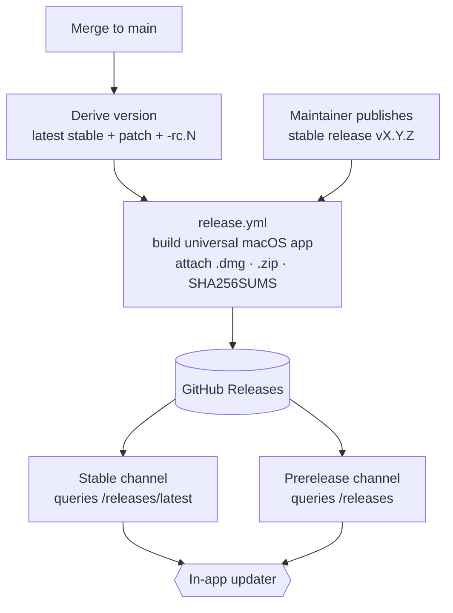

# Releases & Update Channels

How Cascade builds, ships, and self-updates, and how the two update channels
(Stable and Prerelease) work.

## The two release paths

Both run the single job in [`.github/workflows/release.yml`](../.github/workflows/release.yml).

### Stable: manual, human-published
Stable releases are cut by hand. A maintainer creates and publishes a GitHub
Release with a CalVer tag (e.g. `v26.6.4`). Publishing triggers the workflow,
which builds the universal macOS app and attaches the assets to that release:

- `Cascade-<version>-universal.dmg`: the first-time human download.
- `Cascade-<version>-universal.zip`: what the in-app updater downloads (the
  updater rejects `.dmg`).
- `SHA256SUMS`: the sidecar the updater verifies the `.zip` against.

### Prerelease: automatic, on every merge to `main`
Every merge to `main` auto-publishes a GitHub pre-release with the same three
assets, so testers can ride `main` through the normal in-app updater.

The version is derived from the latest stable release, not the calendar:

1. Find the highest stable release tag by SemVer order
   (`gh release list --exclude-pre-releases | sort -V | tail -1`).
2. Bump the patch.
3. Append a monotonic `-rc.<github.run_number>` suffix.

So with latest stable `v26.6.4`, merges publish `v26.6.5-rc.41`,
`v26.6.5-rc.42`, and so on. Each is still flagged as a GitHub pre-release; the
`-rc` suffix only controls SemVer ordering. This gives the updater the ordering
it relies on:

| Comparison | Result | Why it matters |
|---|---|---|
| `v26.6.5-rc.41` vs `v26.6.4` | newer | Prerelease-channel users are offered the build. |
| `v26.6.5-rc.42` vs `v26.6.5-rc.41` | newer | Successive pre-releases order correctly. |
| `v26.6.5` (stable) vs `v26.6.5-rc.42` | newer | Testers roll onto stable once it ships. |

Deriving from the last stable rather than from today's date is deliberate. A
date-based base could land at or below the last stable, and the updater would
then never offer it. `sort -V` (not creation-date order) keeps the base correct
even if a stable hotfix is published out of chronological order. Picking the base
from stable releases only means an existing pre-release never feeds back into the
next version: pre-releases keep stacking on the same `vX.Y.(Z+1)` base until a
new stable ships.

> **No recursion:** the pre-release is created with the default `GITHUB_TOKEN`.
> GitHub does not re-trigger workflows from `GITHUB_TOKEN` events, so creating the
> release does not re-run the `release: published` path. (A PAT would loop.)

Each pre-release's notes are GitHub's auto-generated changelog (merged PRs and new
contributors), diffed from the previous RC if one exists, otherwise the latest
stable. This way an RC shows just what changed since the last build a tester could
have installed. The updater hint is prepended to that changelog.

Pre-releases are not pruned; they accumulate on the Releases page. The updater
only ever reads the single newest release per check, so this is cosmetic.

## Update channels

The **Update channel** setting (Settings → About) chooses which releases the
in-app updater tracks:

- **Stable** (default) queries `/releases/latest`, which excludes pre-releases.
  This is unchanged from historical behaviour.
- **Prerelease** queries `/releases`, taking the newest non-draft (stable or
  pre-release). A user on a stable build who switches here is offered the latest
  `…-rc.*`. A user already on a pre-release is offered the next stable once it
  supersedes their build.

### Implementation
- Persisted via the durable SQLite `settings` table under key `updateChannel`
  (`stable` / `prerelease`), through `App.GetSetting` / `App.SetSetting`. The
  frontend slice lives in [`stores/settings.ts`](../frontend/src/stores/settings.ts),
  the dropdown in [`settings-panel.tsx`](../frontend/src/components/settings-panel.tsx).
- The backend reads it once at startup in [`main.go`](../main.go) via
  `App.updateChannelPrerelease()` ([`app_updater.go`](../app_updater.go)) and sets
  `github.Config.Prerelease` accordingly.

> **Changing the channel requires a restart.** The Wails updater's `Init` is
> single-shot (a second call returns `ErrAlreadyConfigured`), so the channel is
> fixed for the process lifetime. The Settings UI says as much.

The updater is only configured for real release builds (`isReleaseVersion`). Dev
builds (`dev` / `dev-<sha>`) leave it unconfigured, and a manual check surfaces an
`updater:unavailable` notice instead. A pre-release version like `26.6.5-rc.41`
counts as a release build, so pre-releases self-update like any stable build.
