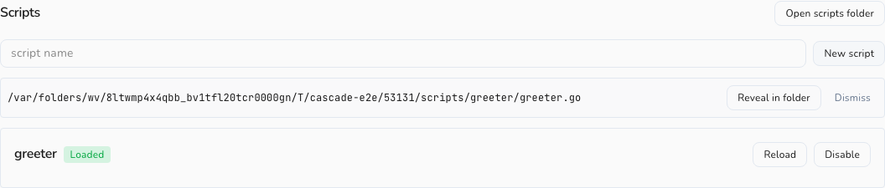

# Managing scripts

The Scripts panel lists every script Cascade knows about and lets you manage each one. Open it from **Settings → Scripts**.

---

## The Scripts panel

The panel lists every script Cascade has discovered in your scripts folder. Each script is a row showing:

- **Name** — the display name from the `// cascade:name` manifest header, or the folder name if none is declared.
- **Status badge** — one of **Loaded**, **Disabled**, **Runaway**, or **Error**. See [Lifecycle & limits](lifecycle-and-limits.md) for what each status means.
- **Description** — the free-text summary from `// cascade:description`, if any.
- **Permission chips** — any permissions listed in `// cascade:permissions`, displayed as small labels next to the description. (In v1 these are informational only. See [Lifecycle & limits](lifecycle-and-limits.md#permissions-v1).)
- **Inline error** — if the script's status is **Error**, the error message appears directly in the row so you can diagnose it without going anywhere else.

---

## Per-row actions

Every row in the Scripts panel has two buttons:

- **Enable / Disable** — toggles the script on or off. Disabling a script stops all event dispatch and cancels its timers immediately. Enabling it runs `Setup` again and resumes dispatch, exactly as a fresh load.
- **Reload** — forces an immediate reload of the script from disk, re-running `Setup` and re-registering timers. Useful if you want to trigger a reload manually rather than waiting for a file-save to do it automatically.

Both buttons are disabled while an action is in progress to prevent double-submits.

---

## Header actions

At the top of the Scripts panel there are two ways to manage scripts at the folder level:

### New script

Type a name into the name field (for example, `greeter`) and click **New script** (or press **Enter**). Cascade:

1. Creates a folder with that name inside your scripts directory.
2. Scaffolds a starter `.go` file with a `package main` declaration and a commented-out `OnText` handler.
3. Shows the full path to the new file inline in the panel with a **Reveal in folder** button so you can find it immediately.

Click **Reveal in folder** to open your system file manager at the scripts directory. Once you have found the file, open it in your editor and start writing.

### Open scripts folder

Opens your system file manager at the scripts directory (`~/.cascade-chat/scripts/` by default) without creating anything. Use this any time you want to browse, rename, or delete script folders directly.

---

## Live status

The Scripts panel subscribes to script lifecycle events in real time. You do not need to refresh it. The moment a script's status changes, the panel updates the relevant row, whether the change came from saving a file, clicking a button, or the watchdog auto-disabling a misbehaving script.

So you can keep the Scripts panel open in the background while you edit a script in your editor. Every save that triggers a hot-reload, and every watchdog action, appears in the panel without any manual intervention.

---

## Editing scripts

There is no in-app editor for scripts. This is intentional: your scripts folder is a real Go module that your editor and gopls can navigate and type-check just like any other Go code. Open the folder in VS Code, Neovim, GoLand, or any editor you prefer.

**To edit a script:**

1. Open the scripts folder (via **Open scripts folder** in the panel, or navigate to `~/.cascade-chat/scripts/` directly).
2. Open the script's `.go` file in your editor.
3. Make your changes and save.

Cascade detects the file change and hot-reloads the script automatically. The panel shows the updated status within a second or two.

If the script fails to load after a save, for example because of a typo or a forbidden import, the row's status badge switches to **Error** and the error message appears inline. Fix the issue and save again, and Cascade reloads once more.

For a step-by-step walkthrough of writing your first script, see [Quickstart](quickstart.md). For a full guide to handlers, the manifest header, and the sandbox rules, see [Writing scripts](writing-scripts.md).
